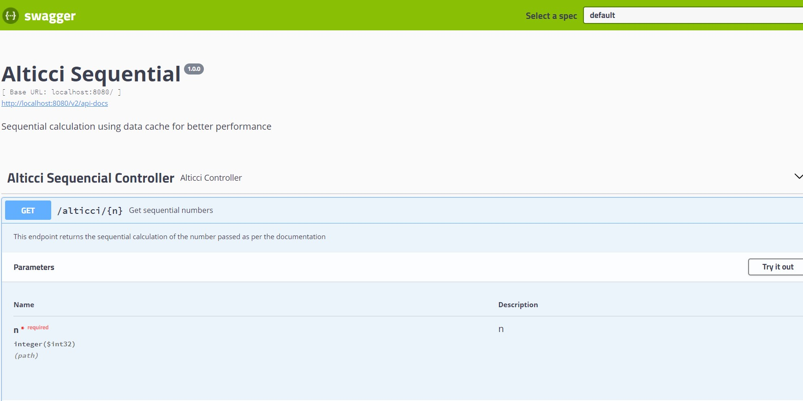
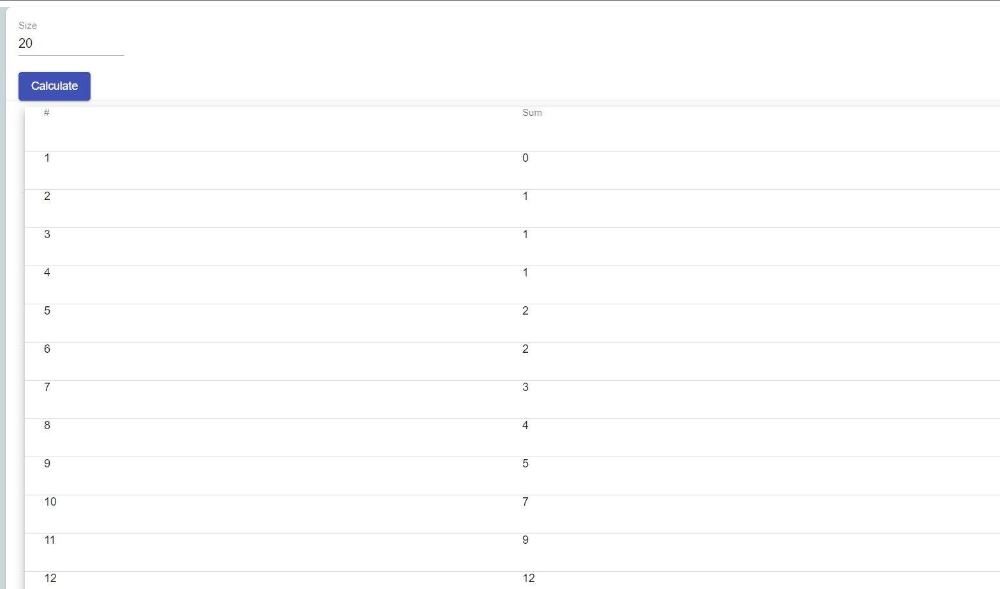
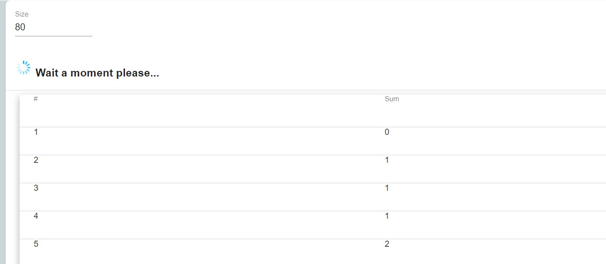
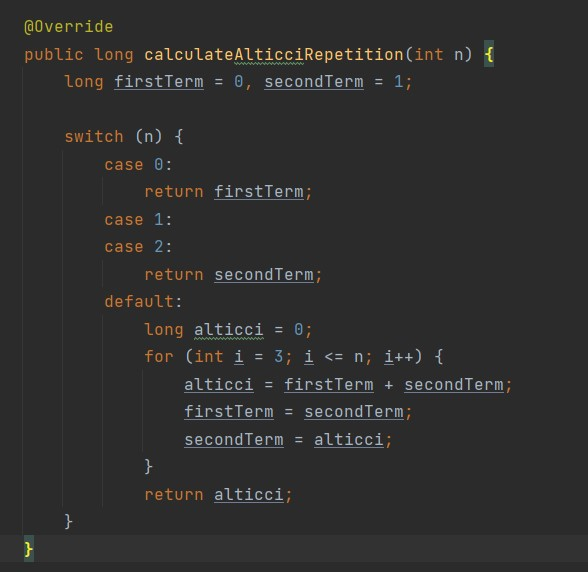

# Calculo sequencial Alticci

Cálculo sequencial usando cache de dados para melhor desempenho

# Tecnologias Utilziadas no back-end

Java 11
 
Maven 3.6.1
 
SpringBoot 2.7.0
 
Mockito 1.10.19
  
Padrão de camadas de controllers e serviços
 

# Tecnologias Utilziadas no front-end

NODE.JS v14.9.0
 
Angular 8
 
Material Design 8.2.3

# Comandos para rodar a aplicação

### Back-end

1 - Na pasta 'alticci-back'
 

- comando: 'mvn package' (será gerado um jar alticci-sequential-1.0.0-SNAPSHOT.jar na pasta ./target) e criado uma
  imagem do back
- Subir a imagem gerada no docker (docker container run -it --rm -p 8080:8080 alticci-back:1.0.0-SNAPSHOT)
   

2- Opção utilizando uma IDE
 

- Executar a classe com o main(AlticciSequentialApplication), irá subir a aplicação na porta 8080
   

### Front-end

1 - Na pasta 'alticci-front'

- Gerar imagem do front 'docker build -t alticci-front .' Obs.: Atenção ao '.' (ponto) no final do comando
- Subir container alticci-front 'docker run --name alticci-container -d -p 4200:80 alticci-front'

# Swagger

http://localhost:8080/swagger-ui.html

# Telas do sistema

- Chamada no postman

  

- Documentação Swagger

  

 

- Tela inicial (iniciando com 20 números)

  

 

- Calculo com quantidade de números altas(informa o usuário do tempo de espera)

  

 

### Observação

- Foi utilizado o cálculo recursivo, neste cenário de utilização de cache, serve bem para exemplificar para grandes
  quantidades de cálculos a vantagem de se usar esta abordagem, mas vale ressaltar que o cálculo recursivo é mais lento
  que o cálculo sequencial(laço de repetição) para este teste estilo fibonacci.
   
   

- Um exemplo de como ficaria com laço de repetição

  

